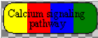
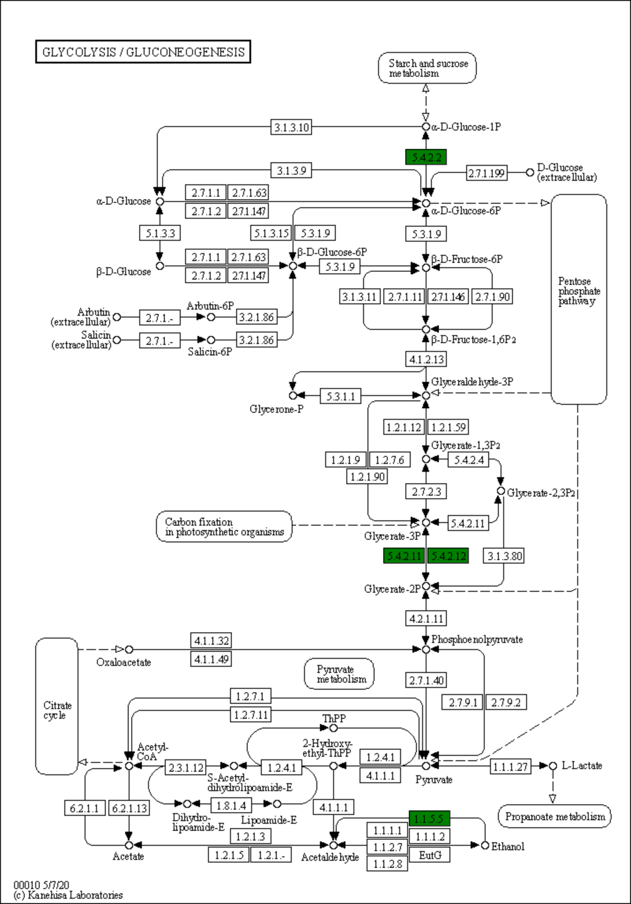
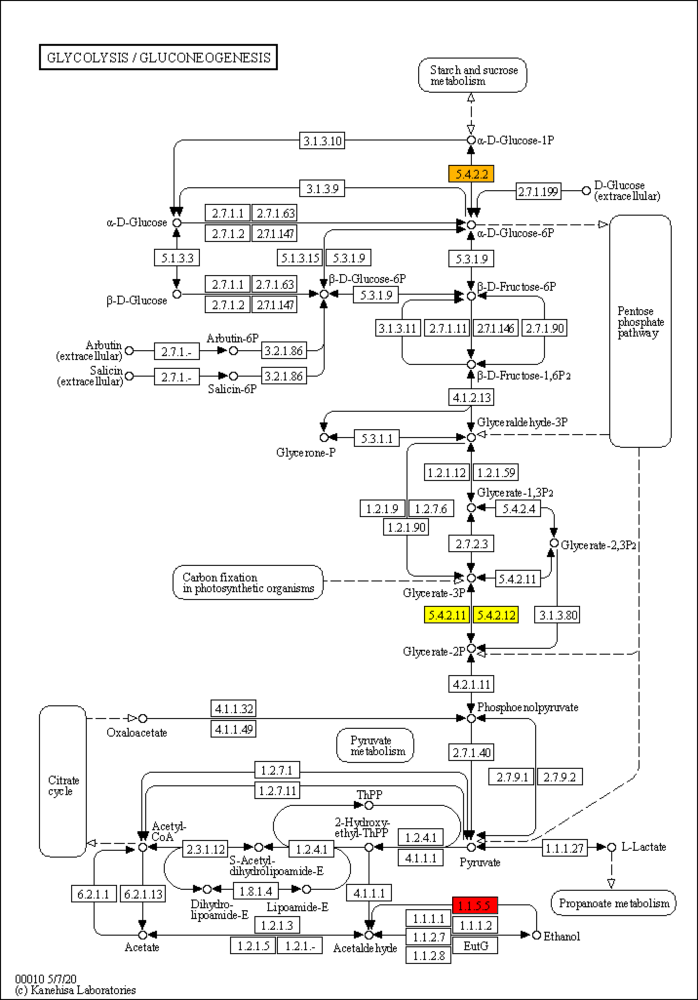
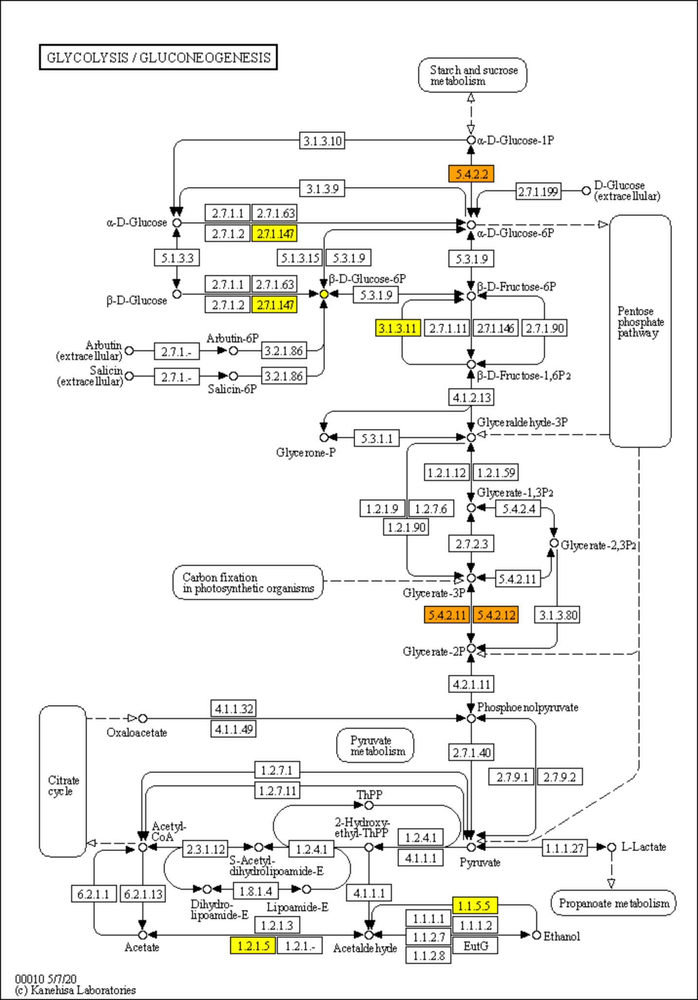
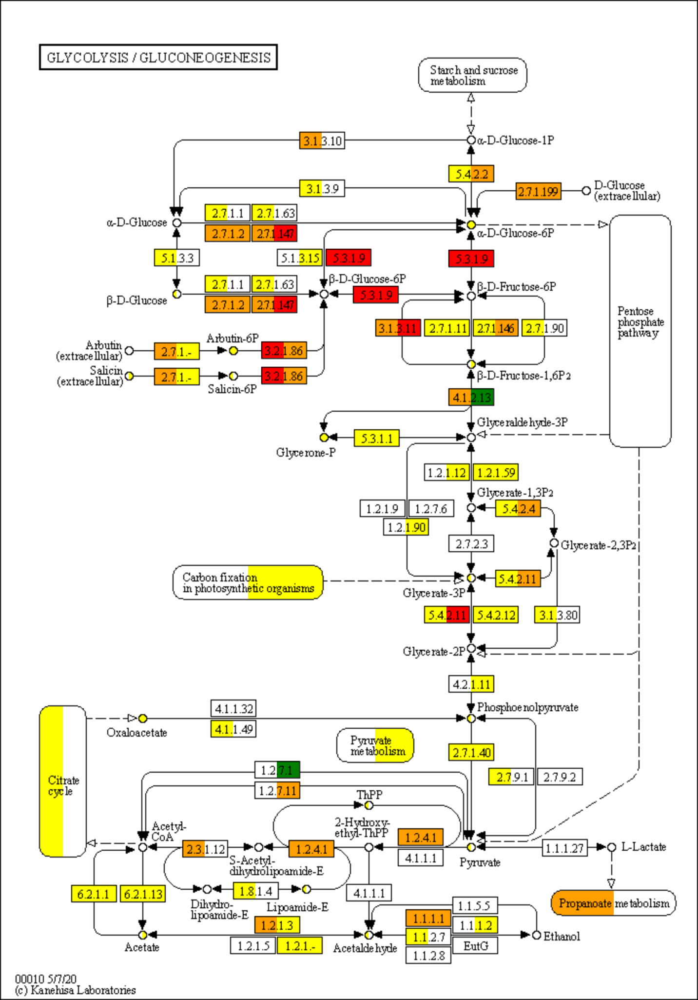

# KeggMapWizard

> **Warning**
> Using this tool may require a [KEGG subscription](https://www.kegg.jp/kegg/legal.html)!

This script downloads KEGG REST data, KEGG configs and KEGG PNGs and converts them into SVG maps which can be processed dynamically using modern
browsers.

I included a simple JavaScript library that enables coloring the maps. It requires

- jQuery
- [chroma.js](https://gka.github.io/chroma.js/) to calculate color gradients
- [html2canvas](https://html2canvas.hertzen.com/) to render the SVGs as PNGs

## Python

### Creating the SVGs

Install the requirements. `pip install poetry && poetry install`

Set the environment variable `KEGG_MAP_WIZARD_DATA` to where you want data to be downloaded to.

```bash
export KEGG_MAP_WIZARD_DATA='/path/to/desired/download/location'
```

or in Python:

```python
import os

os.environ['KEGG_MAP_WIZARD_DATA'] = '/path/to/desired/download/location'
```

In a Python 3.9 console, type:

```python
from kegg_map_wizard import KeggMapWizard, KeggMap, KeggShape, KeggAnnotation, ColorMaker

kmw = KeggMapWizard(orgs=['ko', 'rn', 'ec'])  # merge ko, rn and ec annotations
kmw.download_maps()  # this will download all available KEGG maps
kmw.download_maps(map_ids=['00400'], reload=True)  # this will only download this specific KEGG map

# Create KeggMap object
kegg_map = kmw.create_map('00400')

# Create SVG
svg = kegg_map.svg()

# Save SVG
with open('/path/to/outfile.svg', 'w') as f:
    f.write(svg)
```

By default, all shapes are transparent. Below are some examples on how to apply colors:

```python
def custom_color_function(shape: KeggShape):
    '''Color all shapes red'''
    return 'red'


def custom_color_function(shape: KeggShape):
    '''Color only shapes with the annotation K01623 red'''
    if ('K', 'K01623') in shape.annotations_dict:
        return 'red'
    else:
        return 'transparent'


def custom_color_function(shape: KeggShape):
    '''Color all shapes with 4 sequential colors (yellow, red, blue, green)'''
    shape.definition = ColorMaker.svg_gradient(
        colors=['yellow', 'red', 'blue', 'green'],
        id=shape.hash,
        x1=shape.bbox.x1,
        x2=shape.bbox.x2
    )
    return f'url(#{shape.hash})'


# Create svg using the custom_color_function
svg = kegg_map.svg(color_function=custom_color_function)
```

The last `custom_color_function` results in this: 

The gradient is defined in `shape.definition` and looks like this:

```text
<linearGradient id="{shape.hash}" gradientUnits="userSpaceOnUse" x1="{shape.bbox.x1}" x2="{shape.bbox.x2}">
    <stop offset="25%" stop-color="yellow"></stop><stop offset="25%" stop-color="red"></stop>
    <stop offset="50%" stop-color="red"></stop><stop offset="50%" stop-color="blue"></stop>
    <stop offset="75%" stop-color="blue"></stop><stop offset="75%" stop-color="green"></stop>
</linearGradient>
```

### Testing and colouring SVGs

To test the maps, run a simple http server in the kegg_map_wizard: `python -m http.server 8000`

Then open http://localhost:8000/kegg_map_wizard/html/map_tester.html

## JavaScript

Shapes can not just be colored via Python, but also via JavaScript in the web browser.

For an example, see how this library
is [used in OpenGenomeBrowser](https://opengenomebrowser.bioinformatics.unibe.ch/pathway/?map=kornec00030&g1=@tax:Lactobacillales&g2=@tax:Propionibacteriales)
.

### Required SVG format

The svg should have a title attribute. Example:

```xml

<svg
        title='Phenylalanine, tyrosine and tryptophan biosynthesis'
        version='1.1' baseProfile='full' xmlns='http://www.w3.org/2000/svg' xmlns:xlink='http://www.w3.org/1999/xlink'
        <!-- other attributes -->
        >
```

Each enzyme in the SVG needs to belong to the class `shape` and have the `data-annotations`-attribute. Example:

```xml

<circle cx='978' cy='930' r='4' fill='transparent'  <!-- Must not be circle, can be any other SVG element -->
        title='C00296 (Quinate)'  <!-- will tooltip -->
        class='shape compound'  <!-- only class 'shape' is required -->
        data-annotations='[{"description": "L-Ectoine", "name": "C06231", "type": "KEGG Compound"}]'>  <!-- see below -->
        />
```

The `data-annotations`-attribute tells the KeggMapWizard library which annotations are behind the shape.

Example:

```json
[
  {
    "description": "L-Ectoine",
    "name": "C06231",
    "type": "KEGG Compound"
  }
]
```

###### How access the properties using JavaScript/jQuery

append a click event listener to all shapes:

```JavaScript
$('.shape').click(function (event) {
    showMapMenu(event, this)
})
```

loop over all shapes:

```JavaScript
$(".shape").each(function () {
    // do something
    console.log($(this).attr('title'))  // or 'data-original-title'
})
```

read data-annotations into a variable, loop over annotations, save the changes back into data-annotations:

```JavaScript
let annotations = $(shape).data('annotations')  // read
annotations.forEach(function (annotation, index) {
    // do something
    console.log(annotation['name'])
})
$(shape).data('annotations', annotations)  // save changes
```

###### How to use PathwaySvgLib functions

highlight specific annotations:

```JavaScript
highlightBinary(
    color = "green",
    annotations_to_highlight = ["R01518", "K15778", "K22473"]
)
```



color using continuous numbers:

```JavaScript
highlightContinuous(
    svg = document.getElementById('custom-kegg').firstChild,
    annotation_to_number = {R01518: 0, K15778: 0.5, K22473: 1},
    colors = ['yellow', 'red']
)
```



color organisms with gradient:

```JavaScript
highlightOrganisms(
    svg = document.getElementById('some-svg'),
    organisms = {
        "Organism 1": ["R01518", "K15778", "K22473"],
        "Organism 2": ["K02446", "R00959", "C01172"],
        "Organism 3": ["R01518", "K00129", "EC:2.7.1.147"]
    },
    colors = ['yellow', 'red']
)
```



color **groups of organisms** with gradient:

```JavaScript
highlightGroupsOfOrganisms(
    svg = document.getElementById('some-svg'),
    groupsOfOrganisms = {
        Grp1: {
            "Organism 1": ["R01518", "K15778", "K22473"],
            "Organism 2": ["K02446", "R00959", "C01172"],
            "Organism 3": ["R01518", "K00129", "EC:2.7.1.147"]
        },
        Grp2: {
            "Organism 4": ["R01518", "K15778", "K22473"],
            "Organism 5": ["K02446", "R00959", "C01172"]
        },
    }
)
```

The enzyme boxes will be separated into as many areas as there are groups. Group 1 organisms color the leftmost area, group 2 the second from the
left, etc.



save map as PNG

```JavaScript
saveDivAsPng('id-of-svg')
```
