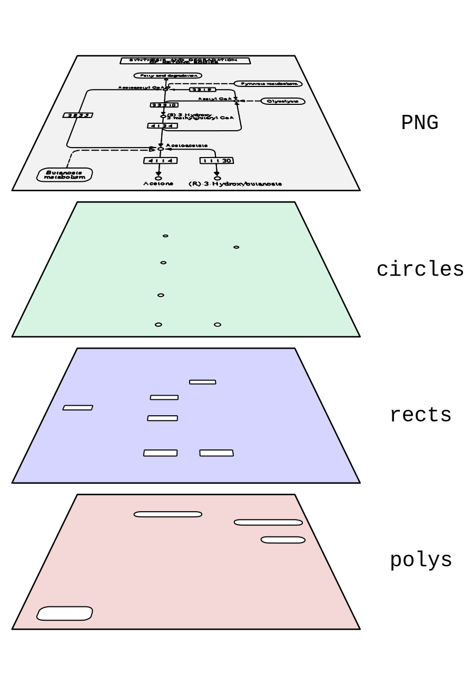

# KeggMapWizard

This script downloads KEGG REST data, KEGG configs and KEGG PNGs and converts them into SVG maps 
which can be processed dynamically using modern browsers.

I included a simple Javascript library that enables coloring the maps. It requires

- jQuery
- [chroma.js](https://gka.github.io/chroma.js/) to calculate color gradients
- [html2canvas](https://html2canvas.hertzen.com/) to render the SVGs as PNGs


## Creating the SVGs

Install the requirements. `pip install requirements.txt`

In a Python 3 console, type:

```python
from kegg_map_wizard.KeggMapWizard import KeggMapWizard

kmw = KeggMapWizard(org='ko')
kmw.download_all_maps()  # this will download all available KEGG maps
kmw.download_map(map_id='00400', reload=True)  # this will only download this specific KEGG map
```

## Testing and colouring SVGs

To test the maps, run a simple http server in the kegg_map_wizard: `python -m http.server 8000`

Then open http://localhost:8000/kegg_map_wizard/html/map_tester.html

## How the SVG works



There are 4 basic layers:

- the URI-encoded PNG, where white pixels have been turned transparent
- circles: contains all shapes that are rendered as circles
- rects: contains all shapes that are rendered as rects
- polys: contains all shapes that are rendered as polys

This is the code of an example shape:

```html
<a title='K00019 (E1.1.1.30), 1.1.1.30, R01361'
   class='shape enzyme'
   data-annotations='[{"description": "E1.1.1.30, bdh; 3-hydroxybutyrate dehydrogenase [EC:1.1.1.30]", "name": "K00019", "type": "KEGG Gene"}, {"description": "3-hydroxybutyrate dehydrogenase; NAD-beta-hydroxybutyrate dehydrogenase; hydroxybutyrate oxidoreductase; beta-hydroxybutyrate dehydrogenase; D-beta-hydroxybutyrate dehydrogenase; D-3-hydroxybutyrate dehydrogenase; D-(-)-3-hydroxybutyrate dehydrogenase; beta-hydroxybutyric acid dehydrogenase; 3-D-hydroxybutyrate dehydrogenase; beta-hydroxybutyric dehydrogenase", "name": "EC:1.1.1.30", "type": "Enzyme Commission"}, {"description": "(R)-3-Hydroxybutanoate:NAD+ oxidoreductase; (R)-3-Hydroxybutanoate + NAD+ \u003c=\u003e Acetoacetate + NADH + H+", "name": "R01361", "type": "KEGG Reaction"}]'>
    <rect x='267' y='454' width='46' height='17' rx='0' ry='0' fill='transparent'/>
</a>
```

#### How access the properties using JavaScript/jQuery

append a click event listener to all shapes:

```javascript
$('.shape').click(function (event) {
    showMapMenu(event, this)
})
```

loop over all shapes:

```javascript
$(".shape").each(function () {
    // do something
    console.log($(this).attr('title'))  // or 'data-original-title'
})
```

read data-annotations into a variable, loop over annotations, save the changes back into data-annotations:

```javascript
let annotations = $(shape).data('annotations')  // read
annotations.forEach(function (annotation, index) {
    // do something
    console.log(annotation['name'])
})
$(shape).data('annotations', annotations)  // save changes
```

#### How to use PathwaySvgLib functions

highlight specific annotations:

```javascript
highlightBinary(
    color = "green",
    annotations_to_highlight = ["R01518", "K15778", "K22473"]
)
```


color using continuous numbers:

```javascript
highlightContinuous(
    svg = document.getElementById('custom-kegg').firstChild,
    annotation_to_number = {R01518: 0, K15778: 0.5, K22473: 1},
    colors = ['yellow', 'red']
)
```


color strains with gradient:

```javascript
highlightStrains(
    svg = document.getElementById('some-svg'),
    strains = {
        "Strain 1": ["R01518", "K15778", "K22473"],
        "Strain 2": ["K02446", "R00959", "C01172"],
        "Strain 3": ["R01518", "K00129", "EC:2.7.1.147"]
    },
    colors = ['yellow', 'red']
)
```


save map as PNG

```javascript
saveDivAsPng('id-of-svg')
```
